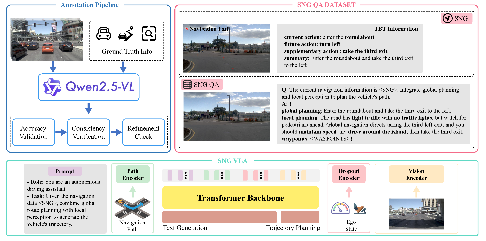

<h1 align="center">Unveiling the Surprising Efficacy of Navigation Understanding in
End-to-End Autonomous Driving</h1>

<p align="center">
<!-- <a href="https://arxiv.org/pdf/2410.08616"></a> -->
<!-- <a href="https://www.youtube.com/watch?v=KbN-mJnXu08"></a> -->
<a href="https://github.com/Zhihua-Hua/NavigationDrive/blob/main/LICENSE"></a>
</p>

<h4 align="center"><em>
<a href="https://github.com/Zhihua-Hua">Zhihua Hua</a>, 
<a href="https://github.com/wjl2244">Junli Wang</a>, 
<a href="https://github.com/Philipflyg">Pengfei Li</a>,
<a href="#">Qihao Jin</a>, 
<a href="#">Bo Zhang</a>, 
<a href="#">Kehua Sheng</a>, 
<a href="#"> Yilun Chen</a>, 
<a href="#">Zhongxue Gan</a>📧, 
<a href="#">Wenchao Ding</a>📧</em>
</h4>

<h5 align="center">
<br>📧 indicates corresponding authors.<br>
<b > Fudan University &nbsp; | &nbsp; Didi Chuxing &nbsp; | &nbsp; AIR, Tsinghua University &nbsp; | &nbsp; CASIA </b>
<!-- <a></a> -->
</h5>

## Abstract
<a align="assets/pipeline.png"></a>
---
Global navigation information and local scene understanding are two crucial components of autonomous driving systems. However, our experimental results indicate that many end-to-end autonomous driving systems tend to over-rely on local scene understanding while failing to utilize global navigation information. These systems exhibit weak correlation between their planning capabilities and navigation input, and struggle to perform navigation-following in complex scenarios. To overcome this limitation, we propose the Sequential Navigation Guidance (SNG) framework, an efficient representation of global navigation information based on real-world navigation patterns. The SNG encompasses both navigation paths for constraining long-term trajectories and turn-by-turn (TBT) information for real-time decision-making logic. We constructed the SNG-QA dataset, a visual question answering (VQA) dataset based on SNG that aligns global and local planning. Additionally, we introduce an efficient model SNG-VLA that fuses local planning with global planning. The SNG-VLA achieves state-of-the-art performance through precise navigation information modeling without requiring auxiliary loss functions from perception tasks. 
<!-- Automatic Emergency Braking (AEB) systems are a crucial component in ensuring the safety of passengers in autonomous vehicles. Conventional AEB systems primarily rely on closed-set perception modules to recognize traffic conditions and assess collision risks. To enhance the adaptability of AEB systems in open scenarios, we propose Dual-AEB, a system combines an advanced multimodal large language model (MLLM) for comprehensive scene understanding and a conventional rule-based rapid AEB to ensure quick response times. To the best of our knowledge, Dual-AEB is the first method to incorporate MLLMs within AEB systems. Through extensive experimentation, we have validated the effectiveness of our method. -->

<!-- ><strong>[Coming Soon]</strong>: We will release full code after papaer acceptance! Stay tuned for updates on this <a href='#'>page</a> -->

---


## Notes
- **2025-02-28:** Initialization. Code coming soon. 💪
- **2026-01-31:** SNG-VLA accepted by ICRA 2026! 🎇
<!-- Stay tuned for updates on this <a href='#'>page</a> -->
<!-- ><strong>[Coming Soon]</strong>: We will release full code after papaer acceptance! Stay tuned for updates on this <a href='#'>page</a> -->

<!-- ## Citation
If you find this work useful in your research, please consider cite: 

```
``` -->

## Citation
If you find this work useful in your research, please consider cite: 

```
```

## Acknowledgments

We thank all the authors who made their codes and datasets public, which tremendously accelerates our project progress. If you find these works helpful, please consider citing them as well.

[Bench2Drive](https://github.com/Thinklab-SJTU/Bench2Drive)
[LLaVA-OneVision](https://github.com/LLaVA-VL/LLaVA-NeXT/)
[navsim](https://github.com/autonomousvision/navsim.git)
